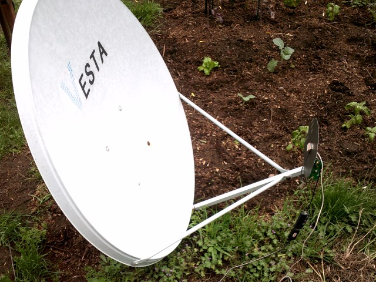
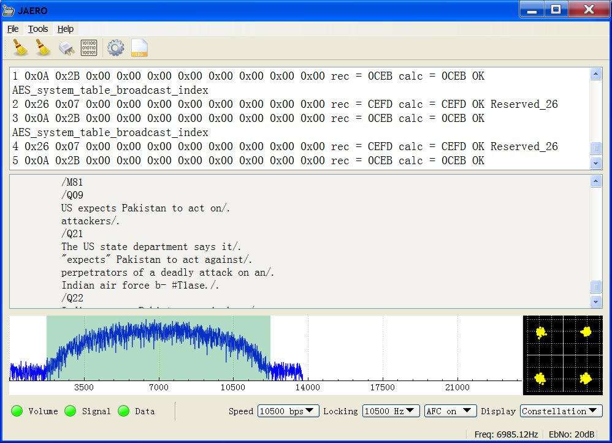

# JAERO

## A program to demodulate and decode Classic Aero SatCom ACARS signals

JAERO is a program that demodulates and decodes Classic Aero [ACARS](https://en.wikipedia.org/wiki/Aircraft_Communications_Addressing_and_Reporting_System) (/Aircraft Communications Addressing and Reporting System/) messages sent from satellites to Aeroplanes (SatCom ACARS) commonly used when Aeroplanes are beyond VHF range. Demodulation is performed using the soundcard. Such signals are typically around 1.5Ghz and can be received with a simple low gain antenna that can be home brewed in a few hours in conjunction with a cheap [RTL-SDR](http://www.rtl-sdr.com/about-rtl-sdr) dongle.

In the advent of MH370, Classic Aero has become a well-known name. A quick search on the net using “Classic Aero MH370” will produce thousands of results. The Classic Aero signals sent from satellites to the Aeroplanes are what JAERO demodulates and decodes.

There are different types of Classic Aero, the main difference being speed. JAERO demodulates the two slowest speeds of 600 bps and 1200 bps as well as the faster rate of 10500 bps. After the signals have been demodulated the ACARS messages are displayed.

*SatCom ACARS reception on 90cm dish*

This program started when I was contacted by otti, a satellite monitoring enthusiast from Europe inquiring whether or not [JMSK](http://jontio.zapto.org/software-and-hardware/jmsk.html) could be used to demodulate the 600 and 1200 Aero signals. Initially I was quite doubtful because in the draft Aero protocol manual that can be freely obtained from [ICAO](http://www.icao.int/Pages/default.aspx) (/International Civil Aviation Organization/) called Part III – Inmarsat and [MTSAT](http://www.icao.int/safety/acp/inactive%20working%20groups%20library/acp-wg-m-iridium-8/ird-swg08-wp07%20-%20old_amss_material_ch.4_plus_attachment.doc), calls the modulation scheme A-BPSK (/aeronautical binary phase shift keying/) and JMSK demodulates MSK (/minimum shift keying/) not BPSK (/binary phase shift keying/). Without even reading the manual I modified JMSK to do 600 and 1200 and to my astonishment it locked extremely well onto a sample signal I had been given. I then read the manual a little more fully and realized yes indeed what they called A-BPSK is really just filtered MSK, this type of signal JMSK does very well with.

After that, things were fairly straightforward. Using the manual I implemented a QDevice class to decode the bitstream, and with a few little tweaks here and there JAERO was born.

## Receiving the RF signal

The signals are transmitted on the L band around 1.5 GHz from geostationary satellites. That means the signals are coming from about 40,000 km away, twice as far away as GPS satellites (20,000 km) and 100 times as far away as the international space station (400 km). Despite the large distance the signals are surprisingly easy to receive. For a list of satellites and locations see the [L band frequency list](http://www.uhf-satcom.com/lband/). The list was last updated 2.5 years ago as a writing (December 2015) so things may have changed a little since then. Alternatively for a more up-to-date list for Europe and the USA scroll down to the user contributed frequency list section [user contributed frequency lists](#ucfl). To know which direction to point your antenna from wherever you are in the world, [DishPointer](http://www.dishpointer.com/) I find handy.

To receive the signal you need an antenna. Initially I tried making a helical antenna but due to my poor construction did not work very well. My second attempt was to simply take the ceramic filter out of an active GPS patch antenna and feed it with some electricity; this is what you see in the figure below.

*Arguably the simplest L band antenna (GPS antenna with filter removed)*

I found the filter somewhat difficult to remove and in the end resorted to brute force by using side cutters to shatter it. While the filter was not entirely removed it was removed enough that it no longer functioned as a filter.

As the modified GPS antenna is an active antenna it needs a power supply. I had a spare PCB with a couple of SMA connectors on it lying around that I put a few random components on to feed power to the GPS receiver while blocking power to the RTL-SDR dongle. The figure below shows a close-up view of the board.

*Power feed to antenna*

The RTL-SDR dongle I used was just some $10 or $20 thing I found on the Internet. My particular one seems to be particularly bad, as well as having the usual bad long-term frequency stability, it also has bad short-term frequency stability.

With this particular setup I pointed the antenna roughly in the direction of the Inmarsat 3F3 satellite and tuned into one of the signals using [SDR#](http://www.rtl-sdr.com/big-list-rtl-sdr-supported-software/) on the laptop. I then took a screenshot which is shown in the figure below.

*SatCom ACARS reception using GPS antenna with filter removed (no dish)*

With this set up the signals are fairly weak at around 6 to 10 dB above the noise floor. However, as can be seen it is clearly possible to demodulate and decode the signal. The following figure shows a screenshot of the frequency spectrum from SDR#.

*Frequency spectrum display of received signal*

GPS signals like the Aero signals are transmitted using RHCP (/Right Hand Circular Polarization/), when such a signal reflects off a surface I believe it is supposed to become LHCP (/Left Hand Circular Polarization/) which RHCP antennas are designed to reject. Therefore, attaching such an antenna to it a satellite dish is not really the right thing to do; I tried it anyway. It seems however any loss incurred due to the RHCP/LHCP thing is offset by the gain you get from the satellite dish. All I had was a 90 cm dish and a 2.3 m dish. The figure below shows the the modified GPS antenna connected to the 90 cm dish.

*90cm dish with modified GPS patch antenna*

According to [Dish gain calculator](http://www.satcom.co.uk/article.asp?article=22), an ideal 90 cm dish should produce 23 dB gain. The very first picture you see on this page is a reception using the 90 cm dish. The EbNo for the 90 cm dish is around 22 dB while with no dish the EbNo is around 6 dB. Therefore that’s an actual gain of around 16 dB. Again from [Dish gain [calculator](http://www.satcom.co.uk/article.asp?article=22) this means the efficiency of the dish is around 19%. According to Wikipedia’s [parabolic antenna](https://en.wikipedia.org/wiki/Parabolic_antenna), “The aperture efficiency of typical parabolic antennas is 0.55 to 0.70”. So all things being considered 19% is OK. Of course this is all very approximate.

To mitigate the frequency stability problems that RTL-SDR dongle have, I put it in a large box wrapped in aluminum foil to protect it from the sun. I live in a very windy location and gusts of wind seem to produce very rapid changes in frequencies which the box seemed to help with. I also left the dongle to run for about half an hour with SDR# before running JAERO.

In New Zealand I have seen ACARS on two satellites, Inmarsat 4F1 and Inmarsat 3F3 both produce roughly the same signal strength here. The signals are easy to see on a frequency spectrum display but can be difficult to hear. as an example of what you might hear you can listen to this audio recording of about 16 kHz bandwidth that contains [four 600 bps signals](https://drive.google.com/uc?export=download&id=0B1561PAMx6wiZE11U2tvVE93bFk). I found to obtain such signals without any buffer loss with RTL-SDR dongle's required me not setting the RTL-SDR sample rate to fast, I tend to use 0.25 MSPS which seems to work well.

## Content

Unlike the usual VHF ACARS, with SatCom ACARS you can not receive signals from the Aeroplane only the people on the ground talking to the people in the Aeroplane. This means you do not get the airplanes reporting their position. Instead you tend to get weather reports, flight plans, and that sort of stuff; but occasionally you get something quite juicy and unexpected. Just like VHF ACARS they usually use cryptic shorthand notation. For example “METAR YSSY 040400Z 08012KT 9999 FEW040 SCT048 23/09 Q1024 FM0500 05012KT CAVOK=” is the weather report for Sydney Airport in Australia in a format called METAR. It tells you the time, when the report was issued, the wind direction and speed, visibility, clouds, temperature, due point and air pressure. Then it says from 5 AM UTC the wind direction and speed and that the weather will be nice. There are sites such as [Flight Utilities](http://www.flightutilities.com/MRonline.aspx) that can decode such information and display it in a more understandable format.

There are a lot of abbreviations used with ACARS so suggest you take a look at some [aviation abbreviations](http://www1.atmb.net.cn/CD_web/UploadFile/2013052810480238.pdf) if you're curious as to what some of the messages are about.

## The program

JAERO can log ACARS messages to disk for later perusal or can be viewed live when running the program. Metric information such as what planes have been heard, when they were last heard, when they were first heard, how many times they have been heard and so on is also maintained. It is possible to record more than one channel simultaneously but can be CPU intensive, cumbersome, and the metric information is not stored correctly.

The program has run successfully on Windows and Linux. Martin Hauke (mnhauke) has kindly made a package available on [openSUSE's open build server](https://build.opensuse.org/package/show/home:mnhauke:sdr/jaero) meaning the installation on openSUSE (a Linux OS) should be as easy as "sudo zypper install jaero" (once the his repo has been added to the package manager "sudo zypper addrepo http://download.opensuse.org/repositories/home:/mnhauke:/sdr/openSUSE_Leap_42.1/" then "sudo zypper refresh" for OpenSUSE's current download version as of writing). Sound piping of at least prerecorded audio apparently works out-of-the-box on openSUSE's pulseaudio on top of ALSA setup too. On Windows it has been tried on 7, 8 and 8.1 successfully.

### JAERO on Linux

*Playing recorded Aero signals into JAERO on Linux*

Currently there is no user manual but the program is reasonably self-explanatory. If anyone wishes to write a manual for others please feel free, I would suggest placing it in the [JAERO wiki](https://github.com/jontio/JAERO/wiki) so others can modify it as time goes by. In the absence of a manual there are a few things that may help to know. To receive the signal you have to pass the audio of the receiver into JAERO. The receiver may be a hardware implementation or the common RTL-SDR dongle with SDR program (such as SDR#) method. For a physical receiver just plugging the audio output into the soundcard is enough. For the RTL-SDR dongle method the usual way people do this is to use a virtual audio cable such as [VB-Audio Virtual Cable](http://vb-audio.pagesperso-orange.fr/Cable/index.htm). The receiver should be set to USB (/Upper Side Band/), however, some receivers seem to be back to front and LSB (/Lower Side Band/) is required. Therefore, if the signal LED lights but the data LED does not, you either have not tuned into an Aero signal or you need to change the USB/LSB setting. If you select "Enable widebandwidth" in the settings you can demodulate signals up to 24 kHz but this uses more CPU, alternatively not having it checked uses less CPU but the upper frequency limit is limited. Currently the logs are saved with <LF> which do not render correctly in notepad.exe.

JAERO is a cross-platform open source program written in C++ Qt. It is hosted on GitHub as jontio/JAERO <https://github.com/jontio/JAERO> so feel free to extend it and improve it. The releases can be found at jontio/JAERO/releases <https://github.com/jontio/JAERO/releases>. Currently I only maintain precompiled versions for Windows 32-bit, these should work on Windows 7 and above for both 32-bit and 64-bit computers

## Version 1.0.2 https://github.com/jontio/JAERO/releases/tag/v1.0.2
    update (Third times a charm)

19-Dec-2015:
This version introduces a few new features and two bug fixes. See the [release page](https://github.com/jontio/JAERO/releases/tag/v1.0.2) for what's new and fixed.

I know some may have wanted an image of each plane to appear automatically in the plane log window without having to download one manually. But due to copyright concerns I had, I've left it so if you want you can save any image to AB1234.png or AB1234.jpg for a plane with an AES of AB1234 and that image will load when that log entry is selected. Clicking on the plane icon will open up a web browser and bring up information about the plane as well as copy the AES to the clipboard.

I've noticed that with the plane database that I've been using military planes don't appear on it. For those planes http://www.airframes.org/ can be used to find information about them.

A quick word about the GES (/Ground Earth Station/) numbers. GES is a number that can tell you both what satellite you're listening to and where on the earth the uplink to the satellite is coming from. However this seems to be confusion as to the relationship between the GES number and the satellite and ground earth station. I have seen two different lists on the Internet which can be summarized in the following three tables (The last two tables come from the same information).

GES ID (Hex)|Location|Oceanic region
-|-|-
02|Southbury|AOR-W
05|Aussaguel|AOR-W
44|Eik|AOR-E
43|Aussaguel|AOR-E
82|Santa Paula|POR
85|Perth|POR
C1|Eik|IOR
C5|Perth|IOR
*GES table 1 (out of date?)*

Table 1 is the standard one people seem to know about and while it looks ok it can't be the full story. The reason being is in New Zealand I have also seen 50 coming from a different satellite further to the west. In addition I have seen someone from Spain but getting the number 90 and the east coast of USA getting D0. These signals I think are coming from Inmarsat 4 satellites which are newer. This brings us to the next information I know of which can be summarized in the following two tables.

GES ID (Hex)|Location|Oceanic region
-|-|-
82|Perth|POR
44|Burum|AOR-E
02|Burum|AOR-W
C1|Perth|IOR
*GES table 2 of I-3 satellite vehicles (*SVs*) (inconsistent with table 1 and missing some GES numbers)*

GES ID (Hex)|Location|Oceanic region
90|Fucino|EMEA
D0|Paumalu|AMER
50|Paumalu|ASIAPAC
*GES table 3 of I-4 SVs (new satellites)*

This seems to solve the problem of where the GES numbers 90, 50 and D0 are coming from but raises another problem. In New Zealand we can get 82 and 85 but 85 is not mentioned in the I-3 SV list. So does that mean we are in the middle of some transition between table 1 and table 2? Is table 1 and table 3 valid but table 2 is not valid just yet? Anyway, you get the idea of the problem.

With a low gain antenna such as a modified GPS patch antenna you can receive multiple satellites at the same time but the signal strengths are low. This is how I accidentally discovered GES 90. With an antenna using a dish the antenna becomes too directional to obtain signals from multiple satellites at the same time.

## Satellite X

Pointing the patch antenna straight up into the sky I happened to tune into one station and got a GES 0x71 packet destined for an Air New Zealand plane. I had never heard of such a GES number. Someone mentioned to me that it might be MTSAT. At this point the penny dropped, the document I followed to decode Aero data was called “Part III – Inmarsat and *MTSAT*”. MTSAT was right there in the document title.

I started looking at packet 0x0C which broadcasts the location of all the satellites as well as packet 0x40 on the control channel which directs airplanes to other channels. This allowed me to produce the following three lists for the three satellites I can see from New Zealand without ever having to use any data external from the information sent from the satellites.

Sat ID 2 at 178.5E Long (+-0.75°)

    GES 82
    1545.010MHz 600bps (Smc)
    1545.030MHz 600bps
    1545.040MHz 600bps
    1545.045MHz 600bps
    1545.155MHz 600bps
    1546.055MHz 10500bps
    1546.085MHz 10500bps

    GES 85
    1545.035MHz 600bps
    1545.095MHz 600bps
    1545.180MHz 600bps
    1545.200MHz 600bps (Smc)
    1546.070MHz 10500bps

Sat ID 5 at 144E Long (+-0.75°)

    GES 50
    1545.055MHz 600bps
    1545.105MHz 600bps (Smc)
    1546.005MHz 10500bps
    1546.035MHz 10500bps

Sat ID 4 142.5E Long (+-0.75°)

    GES 71
    1546.402MHz 600bps
    1546.412MHz 10500bps
    1546.445MHz 600bps
    1546.457MHz 600bps (Smc)
    1546.505MHz 600bps
    1546.535MHz 600bps
    1546.543MHz 10500bps
    1546.570MHz 600bps
    1546.592MHz 600bps
    1548.440MHz 10500bps (spot beam)

Using this method the satellites are not called by a name such as Inmarsat 3F3 but instead by a number such as 2. The location as given by the satellite is accurate to plus or minus 0.75°.

So satellite X is called 4 and is at 142.5E +-0.75° longitude. So might it be MTSAT-2? MTSAT-2 according to http://www.n2yo.com/?s=28937 sits at 145° East, this is miles out from satellite X. Maybe HIMAWARI 8, nope this is 140.6° East according to http://www.satflare.com/track.asp?q=40267#TOP. So the mystery endures. So if you know what this satellite is called besides 4 let me know.

The method I used everyone else can now do using JAERO v1.0.3.1. Simply tune into a control channel (Smc) and look at the packets that appear in the top window, take a note of the 0x40 and 0x0c packets over say an hour and piece together what the satellites are, the control channels and the other channels (Pd). Figuring out the other channels Pd is the reason you need to run it for an hour or so.

Personally I think with all the confusion about where the GES locations are in the world they should all be treated with skepticism. GES 0x71 may be coming from Kobe Japan.

## 10.5k Signal support (part of the Aero-H and Aero-H+ services)

3-Jan-2016:
I am aware of three bit rates used by Aero; 600 1200 and 10.5k. 600 and 1200 both use basically MSK/GMSK, while 10.5k uses OQPSK (/Offset quadrature phase shift keying/). This means for 10.5k support I needed to design and implement an OQPSK demodulator. For the design and testing, I used Matlab, you can see here how the design and testing process went for the [OQPSK demodulator](http://jontio.zapto.org/hda1/oqpsk.html).

## Version 1.0.3 <https://github.com/jontio/JAERO/releases/tag/v1.0.3>
    update (Four times as good)

10-Jan-2016:
JAERO now supports 10.5k signals. With a few small tweaks to the design I implemented the OQPSK demodulator and incorporated it into JAERO. Its about another 1500 lines of new [code](https://github.com/jontio/JAERO/commit/b9bf105e5172661d4f85591158c8fd8065fbe9d4). See here how this implementation went and how the [initial first tests went](http://jontio.zapto.org/hda1/oqpsk-part2.html).

The 10.5k signals I believe are part of the services called Aero-H and Aero-H+ where the H stands for high gain antenna. Here is an [audio sample of these 10.5k signals](https://drive.google.com/uc?export=download&id=0B1561PAMx6widEZXLXZ5dl9WRUU) for you to listen to (or decode), they have a 500ms chirping sound due to the 178bit dummy data. My first impressions of them has been that there is a lot more traffic on them than the 600 and 1200 signals. The 10.5k signals are weaker than the 600 and 1200 ones so you will need an antenna with a higher gain and/or a receiver with a good low noise preamplifier. The OQPSK demodulator in JAERO seems to produce good results down to 6 or 7dB EbNo with next to no errors (I would try and aim for 10dB though just be on the safe side). If you can manage to get a signal strength of 30dB on the 600 or 1200 ones then you should be able to get the 10.5k signals with your current set up. Below is a screenshot of decoding a signal obtained from a 1.2 m dish, the signal strength is over 10dB higher than it need be but produces a very clean constellation diagram.

*10.5k signal using 1.2m dish. They send news on these signals, that was a surprise*

## C-band burst packets. (The excitement starts here)

23-Jan-2016:
As well as the L band signals that people have been using JAERO to demodulate and decode, these Aero satellites also transmit information in the C-band around 3.6 GHz. A standard C-band satellite TV setup along with an F type female socket to SMA and male plug adapter and an SDR receiver is all that is needed to be able to receive them. These signals have successively been obtained using 1.8, 2.3 and 3 m dishes. What is attractive to many about these signals is that they contain the airplane location information. These signals are burst signals and require a burst demodulator for them. Continue reading here about the design, testing with real-life signals, and tips on how to receive such signals. [http://jontio.zapto.org/hda1/c-band.html]()

## A couple of bugs fixed

29-Jan-2016:
I did a minor update and got rid of a couple of bugs. The update is
v1.0.3.1

## Testing 2 RTL-SRDs and 1 SDRPlay receiver for Aero reception

31-Jan-2016:
I was given a loan of an SDRPlay receiver so I decided to have a look at the performance of both the two RTL dongles that I have and that of the SDRPlay on the Aero signals. Continue reading here how the testing [went](http://jontio.zapto.org/hda1/rtl-and-sdrplay/rtl-and-sdrplay.html).

## User contributed frequency lists

Here are some frequency and satellite lists contributed by users that should be useful for people. Not all are for Aero but all are around the Aero frequencies, so if you find something unknown then these non Aero ones may inform you what you have found.

  * [Aero L-band Inmarsat satellites and frequencies](http://jontio.zapto.org/hda1/AERO-March-2016-USA.pdf). Kindly compiled by David.
  * [Aero L-band Inmarsat satellites and frequencies as seen from West Europe](http://jontio.zapto.org/hda1/AERO-March-2016-Europe.pdf). Kindly compiled by Hervé F6DFB.
  * [D+ L-band Inmarsat satellites and frequencies](http://jontio.zapto.org/hda1/Dplus-March-2016-David.pdf). Kindly compiled by David.
  * [C-band burst Aero satellites and frequencies as seen from West Europe](http://jontio.zapto.org/hda1/AERO-Cband-burst-March-2016-Europe.pdf). Kindly compiled by Hervé F6DFB.

## Version 1.0.4 <https://github.com/jontio/JAERO/releases/tag/v1.0.4>
    update (C-band burst packets are here)

20-Feb-2016:
JAERO v1.0.4 now supports 10.5kbps burst C-band Aero signals (3,246 new lines of code!!!). These signals require a larger dish but contain positional information of the airplanes so potentially the airplanes whereabouts could be plotted on a map (if you can understand the format). This means that a plane that is well out of reach of [ADS-B](https://en.wikipedia.org/wiki/Automatic_dependent_surveillance_%E2%80%93_broadcast) can still be tracked. Since MH370 there has been a push to be able to track planes well beyond VHF range, these signals allow one such way of doing this. Continue reading here about this [awesome new feature](http://jontio.zapto.org/hda1/c-band-burst-implementation.html).

v1.0.4 fixes the database download issue, and shows non ACARS messages in hex. Before you update to it you should be aware that you should delete your plane log window as the registration value now filters out the "." and if you don't you'll get some odd repetitions of registration numbers. You will also have to download the database again as it expects the new database format rather than the old one.

## Version 1.0.4.1
    <https://github.com/jontio/JAERO/releases/tag/v1.0.4.1> minor update
    (ADS-C decoding for C-band)

27-Feb-2016:
If you have read the previous page about JAERO supporting [burst C-band Aero](http://jontio.zapto.org/hda1/c-band-burst-implementation.html) you would have noticed a lack of human readable plane position reports. The minor update 1.0.4.1 addresses this issue by decoding and parsing the ADS packets from the C-band into a human readable form such as follows.

|12:00:26 27-02-16 AES:A149DD GES:82 2 .N182UA ! H1 4 BOEING 747-422 UNITED AIRLINES Flight UA869

	F38AUA0869#M1B/B6 OAKODYA.ADS.N182UA0720699D271587D037DD9D0D21EB751DE2C7D003C8224D0D1B6E47D0000E76610A3FFC0F74B1A8FFFC1037A39E78CF70

	Basic_Report:
	  Lat = 45.58 Long = -128.13 Alt = 32000 feet. Time past the hour = 59m 35s FOM = 1D
	  Next waypoint Lat = 47.6995 Long = -129.747 Alt = 32000 feet. ETA = 00:16:08
	  True Track = 333 deg. Ground speed = 532 knots. Vertical rate = -16 fpm.
	  True heading = 328 deg. Mach speed = 0.8495 Vertical rate = -16 fpm.
	  Wind speed = 55.5 knots. True wind direction = 200 deg. Temperature = -49 deg C.

In addition a UDP port is added to output anything that appears in the bottom window of JAERO. This should simplify the design of third-party applications. A possible application could be to show the whereabouts of the planes on a map.

Continue reading more about Experimenting with C-band Aero and Decoding the [ADS packets](http://jontio.zapto.org/hda1/c-band-ads-decoding.html).

## Version 1.0.4.2
    <https://github.com/jontio/JAERO/releases/tag/v1.0.4.2> minor update
    (Planes on maps for C-band is here)

3-Mar-2016:
A small update for C-band users to add support for outputting decoded ADS messages using the SBS1 protocol (also seemingly called BaseStation protocol). This protocol seems reasonably common with other applications and should allow easy connectivity with planes on maps application. See how I went using it to plot my first planes on [maps](http://jontio.zapto.org/hda1/c-band-planes-on-maps.html).

*Planes plotted on a map from data decoded using C-band signals off the I3 POR satellite*

## IRC #hearsat

\#hearsat is an [IRC](https://en.wikipedia.org/wiki/Internet_Relay_Chat) chatroom dedicated to satellite stuff; it seems to be the channel to goto for satellite stuff. So if you're interested in getting into satellite stuff further head on over to the [#hearsat chatroom](http://www.starchat.net/chat/?chan=hearsat). I hear it's an active chatroom with a large number of friendly users who would be more than happy to chat.

## Version 1.0.4.3
    <https://github.com/jontio/JAERO/releases/tag/v1.0.4.3> minor update
    (C-band goes dual channel)

22-Mar-2016:
Small update for C-band users to allow simultaneous demodulation of 2 channels at the same time. Also I've built both 32 and 64 bit Windows versions. If you have a 64bit computer (most people do) then the 64 bit should use a little less CPU. If you are upgrading from the 32 bit to 64 bit version then uninstall the 32 bit version first.

For using dual channels for C-band burst I used this [AUX VFO plugin for SDR#](http://www.rtl-sdr.com/new-sdr-plugin-multiple-vfos/). I added two AUX VFOs to SDR# and selected one to be the left channel while the other I selected to be the right channel. I tuned each VFO independently to each of the T channels on our I3 (POR). This can be seen in the following figure.

*Two AUX VFOs, one for each T channel*

I then selected "10500 bps burst x2" mode in JAERO; the results can be seen in the following figure where both 82T and 85T channels are being demodulated simultaneously.

*JAERO v1.0.4.3 demodulating two channels simultaneously*

## Show your thanks

I have put hundreds of hours into making JAERO so if you want to show your thanks please send a few dollars my way so I can do things like buy some concrete and bolts to mount the big dish or buy another USB extension cord to get the signal at my desktop computer. Thanks.

[PayPal donate button](https://www.paypal.com/nz/cgi-bin/webscr?cmd=_flow&SESSION=QRMzEurxK4R--rzmszxuQEomTZpZNqfSeCjY5VAfxUbJzZ-xkA6YRI3-Kai&dispatch=5885d80a13c0db1f8e263663d3faee8dcce3e160f5b9538489e17951d2c62172)

## Github repository links

* [Repository](https://github.com/jontio/JAERO/)
* [Releases](https://github.com/jontio/JAERO/releases)
* [Wiki](https://github.com/jontio/JAERO/wiki)

## Downloads

* Windows 32bit binary v1.0.4.3
https://github.com/jontio/JAERO/releases/download/v1.0.4.3/JAERO-x32-setup.exe
* Windows 64bit binary v1.0.4.3
https://github.com/jontio/JAERO/releases/download/v1.0.4.3/JAERO-x64-setup.exe
* Source code v1.0.4.3
https://github.com/jontio/JAERO/archive/v1.0.4.3.zip
* Master source https://github.com/jontio/JAERO/zipball/master

Jonti 2016

Jonti. Last modified Wed, 30 Mar 2016 00:48:43 GMT.
